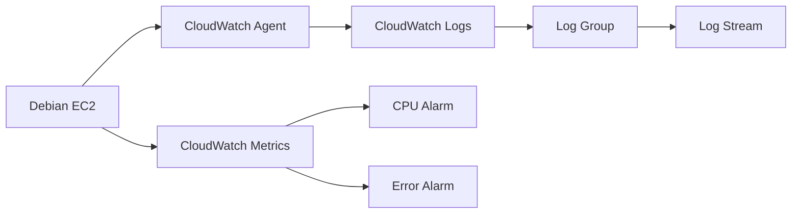

# Terraform: CloudWatch Logging for Debian EC2 - Detailed Setup

Here's a step-by-step implementation guide showing exactly how each Terraform resource corresponds to the logging setup procedure:

## Detailed Implementation Steps

### 1. Configure AWS Provider
```hcl
provider "aws" {
  region = "us-east-1"  # Set your AWS region
}
```
- First block in any Terraform AWS configuration
- Sets authentication and target region
- Credentials are automatically picked up from AWS CLI configuration

### 2. Create CloudWatch Log Group
```hcl
resource "aws_cloudwatch_log_group" "app_log_group" {
  name              = "/ec2/debian-app"
  retention_in_days = 30  # Log retention period
}
```
- Creates a logical container for your logs
- All logs will be stored under this group
- 30-day retention balances cost and accessibility

### 3. Create CloudWatch Log Stream
```hcl
resource "aws_cloudwatch_log_stream" "app_log_stream" {
  name           = "debian-system-logs"
  log_group_name = aws_cloudwatch_log_group.app_log_group.name
}
```
- Creates a specific stream within the log group
- Acts as the destination for your instance logs
- Multiple streams can exist within one group

### 4. Create IAM Role for CloudWatch Access
```hcl
resource "aws_iam_role" "cloudwatch_role" {
  name = "ec2-cloudwatch-role"

  assume_role_policy = jsonencode({
    Version = "2012-10-17",
    Statement = [{
      Action = "sts:AssumeRole",
      Effect = "Allow",
      Principal = { Service = "ec2.amazonaws.com" }
    }]
  })
}
```
- Creates an execution role for EC2
- Allows EC2 service to assume this role
- Foundation for granting permissions to the instance

### 5. Create IAM Policy with Logging Permissions
```hcl
resource "aws_iam_policy" "logging_policy" {
  name        = "cloudwatch-logging-policy"
  description = "Permissions for EC2 to send logs"

  policy = jsonencode({
    Version = "2012-10-17",
    Statement = [{
      Action = [
        "logs:CreateLogStream",
        "logs:PutLogEvents",
        "logs:DescribeLogStreams"
      ],
      Effect   = "Allow",
      Resource = "${aws_cloudwatch_log_group.app_log_group.arn}:*"
    }]
  })
}
```
- Defines specific permissions:
  - Create new log streams
  - Send log events to streams
  - List existing streams
- Granular access control for security

### 6. Attach Policy to Role
```hcl
resource "aws_iam_role_policy_attachment" "policy_attach" {
  role       = aws_iam_role.cloudwatch_role.name
  policy_arn = aws_iam_policy.logging_policy.arn
}
```
- Connects the permission policy to the IAM role
- Without this attachment, permissions won't be applied

### 7. Create IAM Instance Profile
```hcl
resource "aws_iam_instance_profile" "ec2_profile" {
  name = "ec2-cloudwatch-profile"
  role = aws_iam_role.cloudwatch_role.name
}
```
- Creates a container for the IAM role
- Required to attach the role to an EC2 instance
- Acts as a bridge between instance and permissions

### 8. Configure EC2 Instance with Logging
```hcl
resource "aws_instance" "debian_server" {
  ami           = "ami-0f5ee92e2d63afc18" # Debian 11
  instance_type = "t3.micro"
  
  # Attach IAM profile
  iam_instance_profile = aws_iam_instance_profile.ec2_profile.name

  # CloudWatch agent installation and configuration
  user_data = <<-EOF
    #!/bin/bash
    # Install CloudWatch agent
    apt-get update
    apt-get install -y curl
    curl -O https://s3.amazonaws.com/amazoncloudwatch-agent/debian/amd64/latest/amazon-cloudwatch-agent.deb
    dpkg -i -E ./amazon-cloudwatch-agent.deb
    
    # Create agent config
    cat > /opt/aws/amazon-cloudwatch-agent/etc/amazon-cloudwatch-agent.json <<EOL
    {
      "logs": {
        "logs_collected": {
          "files": {
            "collect_list": [
              {
                "file_path": "/var/log/syslog",
                "log_group_name": "${aws_cloudwatch_log_group.app_log_group.name}",
                "log_stream_name": "${aws_cloudwatch_log_stream.app_log_stream.name}",
                "timestamp_format": "%b %d %H:%M:%S"
              }
            ]
          }
        }
      }
    }
    EOL
    
    # Start agent
    systemctl start amazon-cloudwatch-agent
  EOF
}
```
- Uses `user_data` for bootstrap scripting
- Automates agent installation on instance launch
- Configures agent to send /var/log/syslog to CloudWatch
- Agent starts automatically after installation

### 9. Create CPU Utilization Alarm
```hcl
resource "aws_cloudwatch_metric_alarm" "cpu_alarm" {
  alarm_name          = "high-cpu-utilization"
  comparison_operator = "GreaterThanThreshold"
  evaluation_periods  = "2"
  metric_name         = "CPUUtilization"
  namespace           = "AWS/EC2"
  period              = "300"  # 5 minutes
  statistic           = "Average"
  threshold           = "80"   # 80% CPU
  alarm_description   = "Alerts when CPU exceeds 80% for 10 minutes"
  
  dimensions = {
    InstanceId = aws_instance.debian_server.id
  }
}
```
- Monitors CPU utilization metric
- Triggers when average CPU > 80% for 10 minutes (2 periods × 5 min)
- Uses EC2's built-in CPU metrics

### 10. Create Error Rate Alarm (Example)
```hcl
resource "aws_cloudwatch_metric_alarm" "error_alarm" {
  alarm_name          = "high-error-rate"
  comparison_operator = "GreaterThanThreshold"
  evaluation_periods  = "1"
  metric_name         = "HTTPCode_ELB_5XX_Count"  # Example metric
  namespace           = "AWS/ApplicationELB"
  period              = "60"     # 1 minute
  statistic           = "Sum"
  threshold           = "5"      # 5 errors in 1 minute
  alarm_description   = "High HTTP 5xx error rate"
  
  # Note: Requires ELB setup - replace with your metric
}
```
- Example error monitoring configuration
- Would trigger when >5 server errors occur in 1 minute
- Requires application-specific metric setup

## Deployment Workflow

1. **Initialize Terraform**
   ```bash
   terraform init
   ```

2. **Review Execution Plan**
   ```bash
   terraform plan
   ```

3. **Apply Configuration**
   ```bash
   terraform apply
   ```

4. **Verify Setup** (After 5-10 minutes):
   - Check CloudWatch → Log Groups → `/ec2/debian-app`
   - Verify logs appearing in `debian-system-logs` stream
   - Check CloudWatch → Alarms for alarm status

5. **Test Alarms**
   - Generate CPU load:
     ```bash
     sudo apt install stress
     stress --cpu 1 --timeout 600
     ```
   - Verify alarm triggers in the CloudWatch console

## Cleanup
```bash
terraform destroy
```

## Key Security Features
- Least-privilege IAM permissions
- Resource-based permissions
- Encrypted log storage (CloudWatch default)
- Short-lived provisioning credentials
- Explicit resource dependencies

## Troubleshooting Table

| Symptom | Solution |
|---------|----------|
| No logs in CloudWatch | Check IAM role permissions and agent status |
| "Access Denied" errors | Verify policy resource ARNs match log group |
| Agent fails to start | Check `/opt/aws/amazon-cloudwatch-agent/logs` |
| Alarms not triggering | Verify metric namespace/dimensions match |
| High latency in logs | Increase `batch_size` in agent config |

This implementation provides a production-ready foundation that can be extended with:
- SNS notifications for alarms
- VPC flow logging
- Application-specific log streams
- CloudWatch dashboards
- Log-based metric filters

## Architecture Diagram




